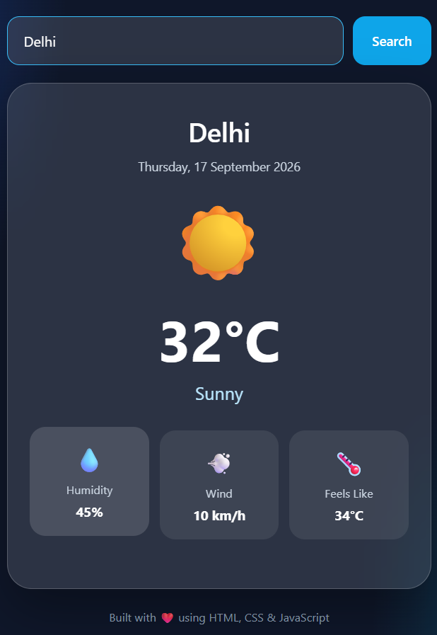

# 🌤️ Weather App

A simple, clean and responsive Weather App built using **HTML, CSS and JavaScript**.

The app allows users to search for a city and view its current weather information.

## 🚀 Live Demo

🔗 [View Weather App](https://syedzayarizvi.github.io/weather-app/)

## ✨ Features

- 🔍 Search weather by city name
- 🌡️ Display temperature
- ☁️ Display weather condition
- 💨 Display wind information
- 💧 Display humidity
- 📱 Responsive design
- 🎨 Clean and simple user interface
- ⚡ Fast and lightweight

## 🛠️ Technologies Used

- HTML5
- CSS3
- JavaScript
- Weather API
- Git & GitHub

## 📁 Project Structure

```text
weather-app/
│
├── index.html       # Main HTML structure
├── style.css        # Styling and responsive design
├── script.js        # JavaScript functionality
└── README.md        # Project documentation


